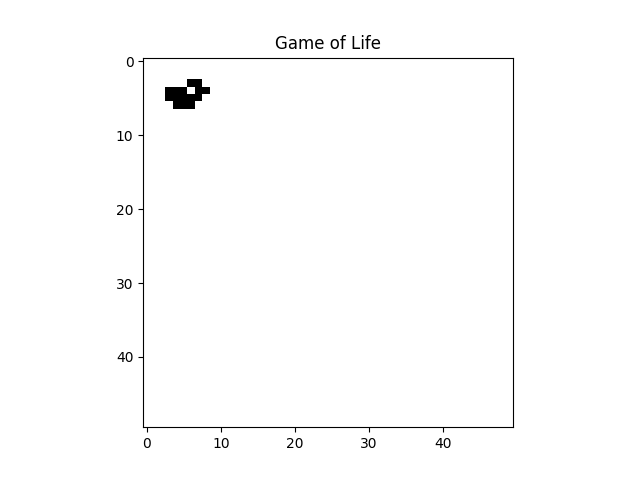

# John Conway's Game of Life :fire:

Using theory of convolutions we can optimize this script and decrease your compilation time. I'm using [Numpy](https://numpy.org/) to create the matrices and [Scipy](https://www.scipy.org/) to realize the convolution and [Matplotlib](https://matplotlib.org
) to plot the generations. Therefore, you need to install these packages in your machine.

- Run this in your command line to install numpy:

    ``` pip install numpy ```

- Run this to install scipy:

    ``` pip install scipy ```

- And this to install matplotlib:
  
  ```pip install matplotlib ```

Now you are ready to enjoy the Game of Life! :zap: 

